<p align="center">
  <picture>
    <source media="(prefers-color-scheme: dark)" srcset=".github/assets/header.svg" />
    <source media="(prefers-color-scheme: light)" srcset=".github/assets/header.svg" />
    
  </picture>
</p>

<p align="center">
  <strong>Open-source MCP servers. Context relay infrastructure for AI systems.</strong>
</p>

<p align="center">
  <a href="#what-is-this">About</a> &nbsp;&middot;&nbsp;
  <a href="#installation">Install</a> &nbsp;&middot;&nbsp;
  <a href="#quick-start">Quick Start</a> &nbsp;&middot;&nbsp;
  <a href="#capabilities">Capabilities</a> &nbsp;&middot;&nbsp;
  <a href="#the-network">Network</a> &nbsp;&middot;&nbsp;
  <a href="#contributing">Contributing</a>
</p>

<p align="center">
  
  
  
  
  
</p>

---

## What is this?

R3L4Y is a collection of open-source MCP (Model Context Protocol) servers that provide context relay infrastructure for AI systems. It includes two production servers: a GitHub Native MCP server and a ComfyUI MCP server.

The GitHub server wraps the `gh` CLI in a Node.js MCP interface, giving AI agents structured access to repositories, issues, pull requests, and GitHub API operations. The ComfyUI server connects AI systems to local image generation through 36+ tools built on FastMCP.

Both servers are designed to be reliable, well-documented, and easy to run. They are the open connective tissue between AI agents and the tools they need.

## Installation

### GitHub Native MCP Server

```bash
cd github-native-mcp
npm install
```

### ComfyUI MCP Server

```bash
cd comfyui-mcp
pip install -r requirements.txt
```

## Quick Start

### GitHub Server

```bash
# Start the GitHub MCP server
cd github-native-mcp
npm start
```

The server requires the `gh` CLI to be installed and authenticated. It exposes GitHub operations — repository management, issue tracking, pull request workflows — as MCP tools.

### ComfyUI Server

```bash
# Start the ComfyUI MCP server
cd comfyui-mcp
python server.py
```

Requires a running ComfyUI instance. The server provides 36+ tools for workflow execution, image generation, model management, and queue control.

```
┌──────────────────────────────────────────┐
│  SYSTEM NOTICE                           │
│  ──────────────────────────────────────  │
│  NODE TYPE : RELAY_NODE                  │
│  STATUS    : ACTIVE                      │
│  PROTOCOL  : MCP                         │
└──────────────────────────────────────────┘
```

## Capabilities

- **GitHub Native MCP server** — full GitHub API access through the `gh` CLI
- **ComfyUI MCP server** — 36+ tools for local AI image generation via FastMCP
- **Repository operations** — clone, branch, commit, PR workflows through structured MCP tools
- **Image generation** — workflow execution, queue management, model loading, output retrieval
- **MCP management tools** — server lifecycle, health checks, and configuration utilities
- **Production-ready** — tested, documented, and designed for real workloads

<details>
<summary><strong>Technical Context</strong></summary>

R3L4Y implements the Model Context Protocol specification to provide AI agents with structured access to external tools and services. Each server exposes its capabilities as MCP tools with typed inputs and outputs.

The GitHub Native server is built on Node.js and delegates operations to the `gh` CLI, which handles authentication, rate limiting, and API versioning. This approach keeps the server thin and benefits from GitHub's own CLI improvements.

The ComfyUI server is built on Python with FastMCP. It communicates with a local ComfyUI instance over its HTTP API, translating MCP tool calls into workflow executions, queue operations, and asset management commands.

</details>

## The Network

| Node | Role |
|------|------|
| [S4F3-R0UT3-4RB1T3R](https://github.com/46b-ETYKiAL/S4F3-R0UT3-4RB1T3R) | Central orchestration |
| [S4F3-3TCH](https://github.com/46b-ETYKiAL/S4F3-3TCH) | ComfyUI custom nodes |

## Tech Stack

| Layer | Technology |
|-------|------------|
| GitHub Server | Node.js, gh CLI |
| ComfyUI Server | Python, FastMCP |
| Protocol | MCP (Model Context Protocol) |
| License | Apache 2.0 |

## Status


> [!TIP]
> This project is open source under the Apache 2.0 license. Contributions welcome.

## Contributing

Contributions are welcome. Please read [CONTRIBUTING.md](CONTRIBUTING.md) for guidelines on submitting issues, feature requests, and pull requests.

## License

Licensed under the Apache License, Version 2.0. See [LICENSE](LICENSE) for the full text.

```
Copyright 2026 Itasha Corp

Licensed under the Apache License, Version 2.0 (the "License");
you may not use this file except in compliance with the License.
You may obtain a copy of the License at

    http://www.apache.org/licenses/LICENSE-2.0

Unless required by applicable law or agreed to in writing, software
distributed under the License is distributed on an "AS IS" BASIS,
WITHOUT WARRANTIES OR CONDITIONS OF ANY KIND, either express or implied.
See the License for the specific language governing permissions and
limitations under the License.
```

<p align="center">
  <picture>
    <source media="(prefers-color-scheme: dark)" srcset=".github/assets/footer.svg" />
    <source media="(prefers-color-scheme: light)" srcset=".github/assets/footer.svg" />
    
  </picture>
</p>
